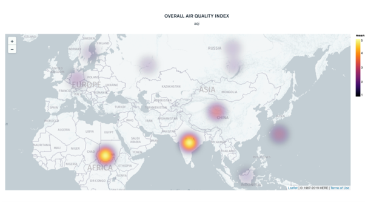

# Weather-and-Air-Quality-Analysis

## Introduction

The goal of this project is to perform Weather-and-Air-Quality data analytics on data using various tools and technologies

## Architecture 

## Technology Used
Data Buffer: Confluent Kafka - 
           
 Confluent Platform is a full-featured data streaming platform that makes it simple to access, store, and manage data in continuous, real-time streams.  Apache Kafka is an event streaming platform that uses PUB/SUB architecture to process the messages. Producers are client applications that publish (write) events to Kafka, and consumers are client applications that subscribe to (read and process) these events

Database: Mongo DB Atlas – 

Cloud based service to store data

Connector: MongoDB Sink –

The MongoDB Kafka connector is a Confluent-verified connector that publishes changes from MongoDB into Kafka topics as a data source and persists data from Kafka topics as a data sink into MongoDB.

Cloud –
GCP – For confluent platform, GCP is the cloud used. All the services are run on GCP. We have created a virtual machine on GCP to run the script.

Programming language: 
Python – We have written python script for producer client

Visualization: 
Jupyter Notebook, MongoDB Chart, Tableau used for visualization.

## Dataset Used
One Call API:
This API provides the hourly, minutely , daily  current weather data for free subscription .
By using this parameter you can exclude some parts of the weather data from the API response. 

Open Weather API:
openweathermap.org/api is a website that provides  global weather data  like temperature , humidity ,etc. 
This data source provides various APIs to fetch the weather data by providing latitude , longitude as request parameters along with API key.

## Some visualization

